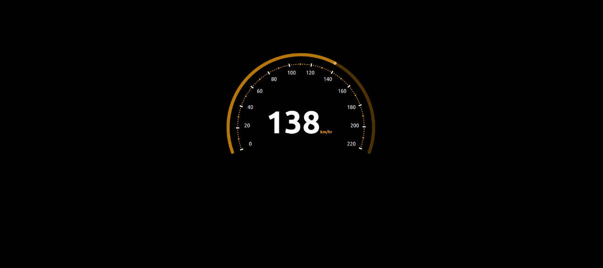

# Samespace Assignment

This assignment was completed by Aditya Priyam.
The assignment in hosted at https://speedometer-samespace.web.app/

# Dependencies

1. NPM
2. Node
3. React
4. React-DOM
5. Lodash

# Build Steps

1. Clone the document to your local system. Use the command `git clone https://github.com/iAmPriyam/samespace-assignment.git`
2. Move inside the directory and install all the dependencies using the command `npm install`
3. Start the local server using the command `npm start`

Server will start running at http://localhost:3000/

# Screenshot

The following is the screenshot of the speedometer widget

